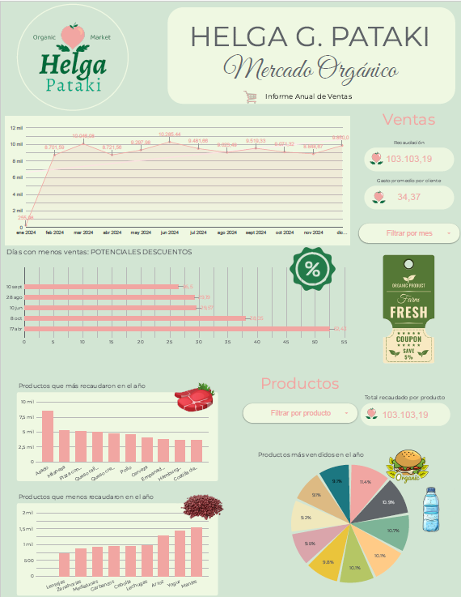

📊 Dashboard de Business Intelligence - Mercado Orgánico

📸 Vista previa

## 🚀 Dashboard interactivo

👉 **[Ver Dashboard en Looker Studio](https://datastudio.google.com/reporting/e2530bf9-c456-4660-b532-164a5fd68930)**

Dashboard interactivo desarrollado en Looker Studio para el análisis de ventas de un mercado orgánico, con el objetivo de transformar datos en información útil para la toma de decisiones comerciales.

📌 Descripción

Este proyecto fue desarrollado como práctica de Business Intelligence, utilizando Looker Studio para construir un dashboard interactivo que permite analizar el rendimiento de las ventas de una dietética a través de distintos indicadores y filtros dinámicos.

El tablero facilita el seguimiento de las ventas, la identificación de oportunidades de mejora y el análisis del comportamiento de los productos durante el año.

🎯 Objetivos del proyecto
Analizar la evolución de las ventas.
Detectar períodos de mayor y menor actividad comercial.
Identificar los productos con mayor impacto en la facturación.
Facilitar la toma de decisiones mediante visualizaciones interactivas.

🛠️ Herramientas utilizadas
📊 Looker Studio
📑 Google Sheets / Excel (fuente de datos)
📈 Business Intelligence
📉 Análisis y visualización de datos
📊 Funcionalidades del Dashboard
📅 Evolución de ventas por mes

Esta información puede utilizarse para:

Implementar promociones.
Aplicar descuentos.
Planificar campañas de marketing.
Incrementar las ventas en períodos de baja demanda.
💰 Productos con mayor y menor recaudación

El dashboard permite identificar:

Los productos que generan mayores ingresos.
Los productos con menor facturación.

Además incorpora filtros por producto para realizar un análisis individual.

🥧 Productos más vendidos

Gráfico de torta que muestra la participación de cada producto dentro del total de ventas anuales, facilitando la identificación de los artículos con mayor demanda.
ocio.

El objetivo principal fue construir un dashboard que no solo mostrara información, sino que permitiera explorar los datos mediante filtros interactivos y obtener insights útiles para la gestión comercial de un mercado orgánico.
